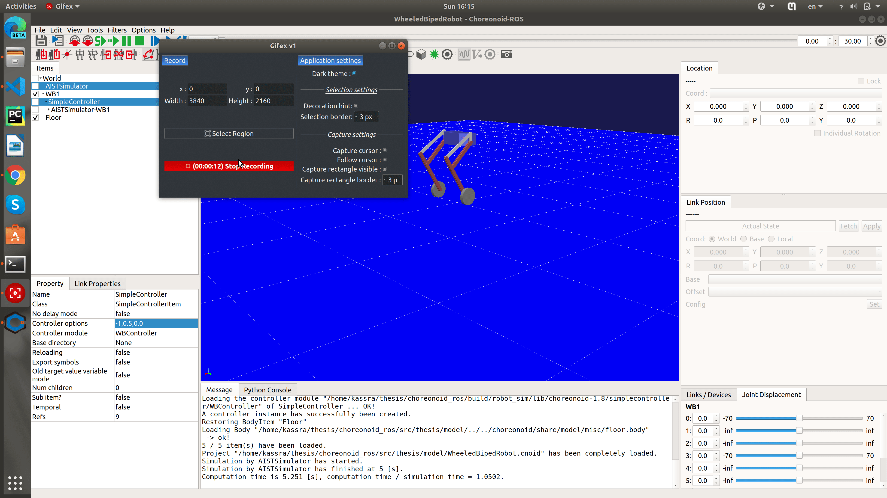
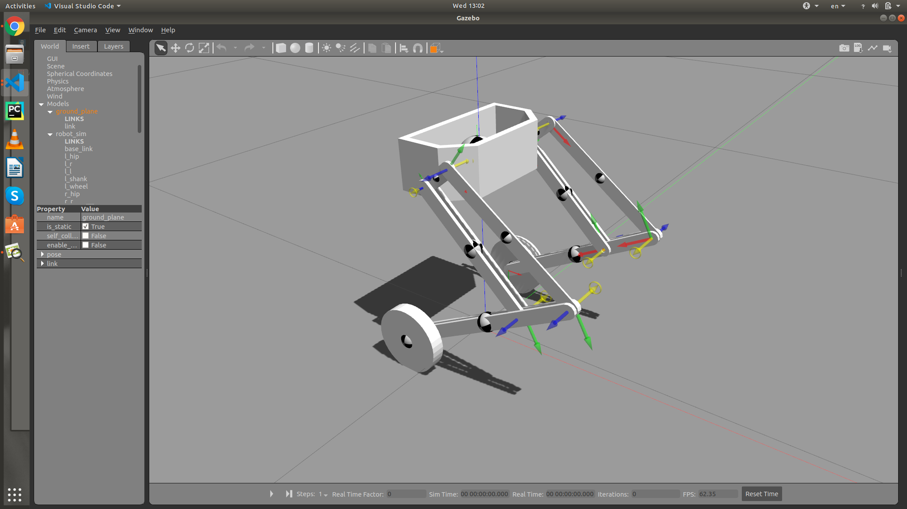

# 6-DoF Wheeled Bipedal Robot
Balance Control of a 6-DoF wheeled biped robot
- - -
## Description
### Project Overvirview
This thesis was done as a part of Mechanical Engineering BSc. program at the University of Tehran. The main objective of this project is Dynamic Balance Control of a 6-Degrees of Freedom Wheeled Bipedal robot to achieve roboust planar motion. Linear Quadratic Regulator (LQR) has been utilized for balancing and controlling robot position. Simplified model of Two Wheel Self-Balancing Robot was used instead of full dynamic model of the robot for simplification. Inverse Kinematics has been solved geometrically, this part is quite starightforward. 
More info about the theory could be found at [My Personal Website](http://kasra-sinaei.ir/).
### Repository
This repository contains simulation package of a hybrid wheeled legged robot. Simulations are in Choreonoid and Gazebo. There are 3 packages in this repository:
<ul>
    <li>robot_control: main control loop of the robot</li>
    <li>robot_sim: choreonoid simple controller (connects ROS to choreonoid)</li>
    <li>gazebo_sim: contains Gazebo model and robot configuration files</li>
</ul>

- - -
## Build and Run

&#9888 This package depends on several libraries and packages, make sure to install them before building. 
<ul>
    <li>Catkin build Tools (Python)</li>
    <li>Install Choreonoid version 1.8 that is adaptable with ROS. Detailed instructions could be found at <a href=https://choreonoid.org/ja/manuals/latest/ros/build-choreonoid.html>Choreonoid Documents</a>. </li>
    <li>Install Python Control Package; instructions could be found <a href=https://python-control.readthedocs.io/en/0.8.3/intro.html>here</a>.</li>
    <li>ROS Control and ROS Gazebo Control are essential for Gazebo Simulation. If you prefer Gazebo to Choreonoid (seriously?), make sure to have them correctly installed on your device.</li>
</ul>
Note that prefered simulation environment in this project is Choreonid. 

### Choreonoid

1- Clone this repository in the src folder of your work space.  
2- Build all packages using `catkin build`  
3- Open Terminal in the workspace direcrory and run `source devel/setup.bash`  
4- Launch all nodes `roslaunch robot_sim wb_sim.launch`  
5- In Choreonoid go to File>Open Project, then select model/WheeledBipedRobot.cnoid  
6- Select Simple Controller bellow Item. In the controller options write three numbers: robot height, desired location X, desired heading.  
7- Start Simulation.  

### Gazebo
1- Do steps 1-3 of choreonoid build process.  
2- `roslaunch gazebo_sim wb_full.launch`  
 

 

