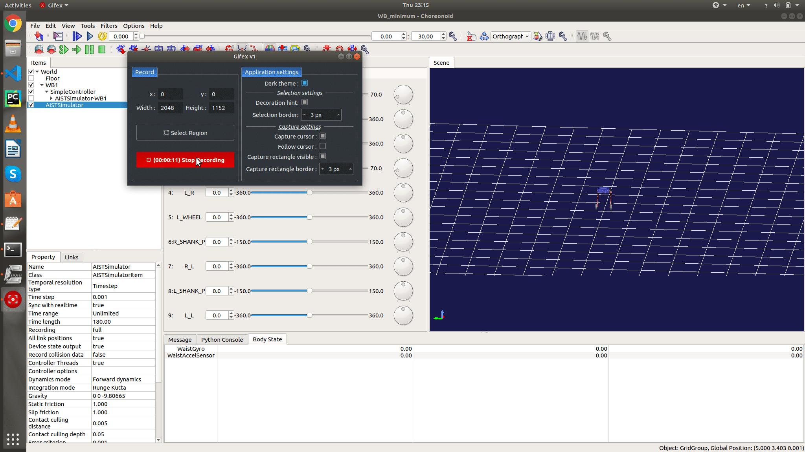

# wheeled_biped_robot
6-DoF wheeled biped robot

 

9888 This Project is in progress...
 
 

<b>How To Run</b> 
1.Choreonoid sim 
<ol>
  <li>Open choreonoid GUI</li>
  <li>Add each file in choreonoid Branch to similar folder in choreonoid directory</li>
  <li> File->Open Project->WB_minimum.cnoid </li>
  <li> Run AISTSimulator </li>
</ol>
 
 
 
1.Gazebo Simulation sim 
<ol>
  <li>Create Catkin Workspace and clone src folder to your catkin_ws/src directory</li>
  <li> Go to catkin_ws and run $catkin_make</li>
  <li> To run simulation without contrller run $ roslaunch robot_sim robot_full.launch </li>
  <li> To run simulation with contrller run $ roslaunch robot_control const_pid.launch </li>
</ol>
 

