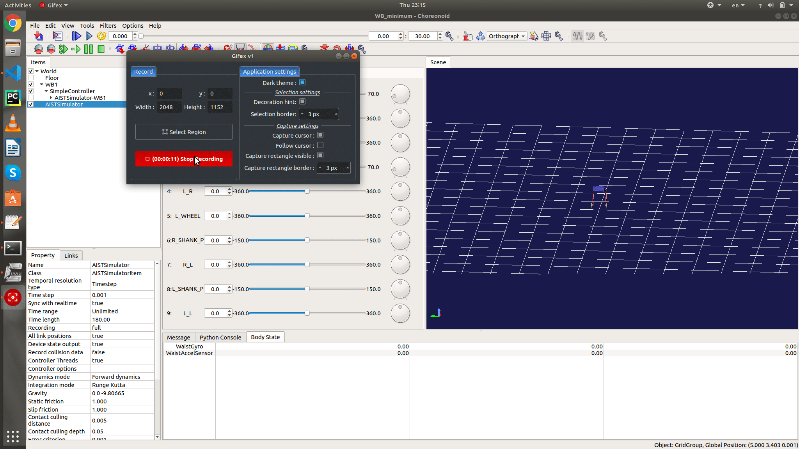
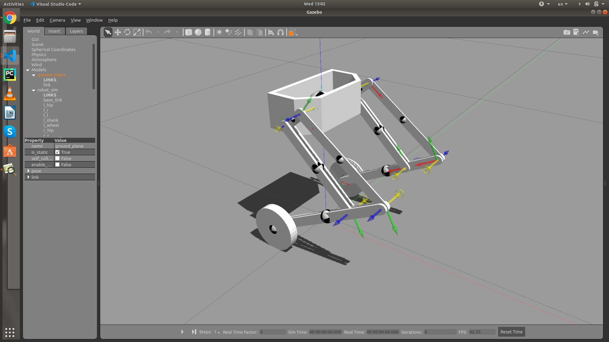

# wheeled_biped_robot
6-DoF wheeled biped robot

 

9888 This Project is in progress...
 
 

<b>How To Run</b> 
1.Choreonoid sim 
<dl>
  <dt>Open choreonoid GUI</dt>
  <dt>Add each file in choreonoid Branch to similar folder in choreonoid directory</dt>
  <dt> File->Open Project->WB_minimum.cnoid </dt>
  <dt> Run AISTSimulator </dt>
</dl>
 
 
 
1.Gazebo Simulation sim 
<dl>
  <dt>Create Catkin Workspace and clone src folder to your catkin_ws/src directory</dt>
  <dt> Go to catkin_ws and run $catkin_make</dt>
  <dt> To run simulation without contrller run $ roslaunch robot_sim robot_full.launch </dt>
  <dt> To run simulation with contrller run $ roslaunch robot_control const_pid.launch </dt>
</dl>
 

